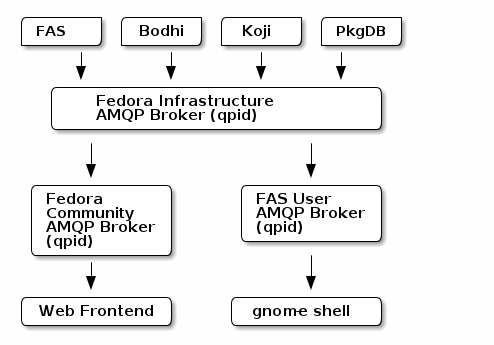
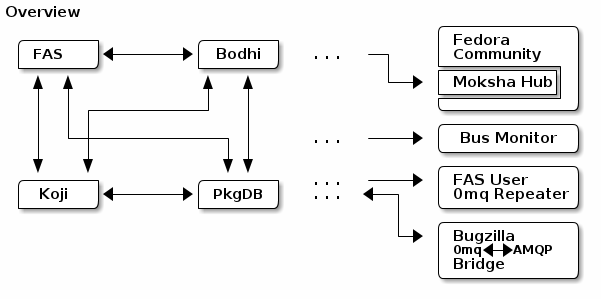

========
Overview
========

Description of the problem
~~~~~~~~~~~~~~~~~~~~~~~~~~

Fedora Infrastructure is composed of a number of services (koji, fedpkg, pkgdb,
etc..) some of which are maintained outside the Fedora Project and some of which
were built in-house by the infrastructure team.  These are strung together in
a pipeline.  Think "how an upstream release becomes a package update", "How a
new source distribution becomes a package."

At present, many of the steps in this process require the maintainer to wait and
watch for a previous step to complete.  For instance once a branch of a
package is successfully built in koji, the maintainer must `submit their
update to bodhi
<https://fedoraproject.org/wiki/PackageMaintainers/UpdatingPackageHowTo#Submit_your_update_to_Bodhi>`_
(See the `new package process
<https://fedoraproject.org/wiki/New_package_process_for_existing_contributors>`_
for more details).

Other progressions in the pipeline are automated.  For instance, `AutoQA
<https://fedoraproject.org/wiki/AutoQA_architecture>`_ defines a `set of
watchers
<https://git.fedorahosted.org/git/?p=autoqa.git;a=tree;f=watchers;h=af4f6d5e68e9dfcff938d0481ac65fa52bcd1d17;hb=HEAD>`_.
Most watchers are run as a cron task.  Each one looks for `certain events
<https://git.fedorahosted.org/git/?p=autoqa.git;a=tree;f=events>`_ and fires off
tests when appropriate.

At LinuxFest Northwest (2009), jkeating gave `a talk
<http://jkeating.fedorapeople.org/lfnw-messaging-2009.pdf>`_ on the problem of
complexity in the Fedora infrastructure and how this might be addressed with a
message bus architecture.  Each service in the infrastructure depends on
many of the others.  Some pieces directly poke others:  git (fedpkg) currently
pokes AutoQA from a post-update hook.  Other pieces poll others' status:  koji
scrapes pkgdb for package-owner relationships and email aliases.

This dense coupling of services makes changing, adding, or replacing services
more complicated:  commits to one project require a spidering of code changes
to all the others.

How messaging might address the problem
~~~~~~~~~~~~~~~~~~~~~~~~~~~~~~~~~~~~~~~

jkeating's `talk on messaging in the Fedora Instructure
<http://jkeating.fedorapeople.org/lfnw-messaging-2009.pdf>`_ proposed the
adoption of a unified message bus to reduce the complexity of multiple
interdependent services.  Instead of a service interfacing with its
dependencies' implementations, it could subscribe to a `topic`, provide a
callback, and respond to events.

For instance, instead of having koji scrape pkgdb on an interval for changed
email addresses, pkgdb could emit messages to the
``org.fedoraproject.service.pkgdb`` topic whenever an account's email address
changes.  koji could subscribe to the same topic and provide a callback that
updates its local email aliases when invoked.

In another case, the git (fedpkg) post-update hook could publish messages to
the ``org.fedoraproject.service.fedpkg.post-update`` topic.  AutoQA could
subscribe to the same.  Now if we wanted to enable another service to act when
updates are pushed to fedpkg, that service need only subscribe to the topic and
implement its own callback instead of appending its own call to fedpkg's
post-update hook (instead of coupling its own implementation with fedpkg's).

A message bus architecture, once complete, would dramatically reduce the work
required to update and maintain services in the Fedora infrastructure.

Other benefits
~~~~~~~~~~~~~~

By adopting a messaging strategy for Fedora Infrastructure we could gain:

 - A stream of data which we can watch and from which we can garner statistics
   about infrastructure activity.
 - The de-coupling of services from one another.
 - libnotify notifications to developers' desktops.
 - jquery.gritter.js notifications to web interfaces.

   - this could be generalized to a ``fedmsg.wsgi`` middleware layer that
     injects a fedora messaging dashboard header into every page served by apps
     `X`, `Y`, and `Z`.

 - An irc channel, ``#fedora-fedmsg`` that echoes every message on the bus.
 - An identi.ca account, @fedora-firehose, that echoes every message on the bus.

AMQP, and 0mq
-------------

AMQP or "Broker?  Damn near killed 'er!"
~~~~~~~~~~~~~~~~~~~~~~~~~~~~~~~~~~~~~~~~

When discussions on the `Fedora Messaging SIG
<https://fedoraproject.org/wiki/Messaging_SIG>`_ began, AMQP was the choice by
default.  Since then members of the SIG have become attracted to an alternative
messaging interface called `0mq <http://www.zeromq.org>`_.

Recommended reading:

 - `What's wrong with AMQP
   <http://www.imatix.com/articles:whats-wrong-with-amqp>`_

The following is recreated from J5's Publish/Subscribe Messaging Proposal
as an example of how Fedora Infrastructure could be reorganized with AMQP
and a set of federated AMQP brokers (qpid).

The gist is that each service in the Fedora Infrastructure would have the
address of a central message broker on hand.  On startup, each service would
connect to that broker, ask the broker to establish its outgoing queues, and
begin publishing messages.  Similarly, each service would ask the broker to
establish incoming queues for them.  The broker would handle the routing of
messages based on ``routing_keys`` (otherwise known as `topics`) from each
service to the others.

The downshot, in short, is that AMQP requires standing up a single central
broker and thus a single-point-of-failure.  In the author's work on `narcissus
<http://narcissus.rc.rit.edu>`_ I found that for even the most simple of AMQP
configurations, my qpid brokers' queues would bloat over time until \*pop\*,
the broker would fall over.

0mq or "Going for Broke(rless)"
~~~~~~~~~~~~~~~~~~~~~~~~~~~~~~~

0mq is developed by a team that had a hand in the original development of AMQP.
It claims to be a number of things: an "intelligent transport layer",
a "socket library that acts as a concurrency framework", and the `sine qua non`
"Extra Spicy Sockets!"

Recommended reading:
 - `The Z-guide <http://zguide.zeromq.org/page:all>`_

The following depicts an overview of a subset of Fedora Infrastructure
organized with a decentralized 0mq bus parallel to the spirit of J5's
recreated diagram in the AMQP section above.

No broker.  The gist is that each service will open a port and begin
publishing messages ("bind to" in zmq-language).  Each other service will
connect to that port to begin consuming messages.  Without a central broker
doing `all the things
<http://www.imatix.com/articles:whats-wrong-with-amqp>`_, 0mq can afford a high
throughput.  For instance, in initial tests of a 0mq-enabled `moksha hub
<https://moksha.fedorahosted.org>`_, the Fedora Engineering Team achieved a
100-fold speedup over AMQP.

Service discovery
~~~~~~~~~~~~~~~~~

Shortly after you begin thinking over how to enable Fedora Infrastructure to
pass messages over a `fabric` instead of to a `broker`, you arrive at the
problem we'll call "service discovery".

In reality, (almost) every service both `produces` and `consumes` messages.  For
the sake of argument, we'll talk here just about a separate `producing
service` and some `consuming services`.

Scenario:  the producing service starts up a producing socket (with a hidden
queue) and begins producing messages.  Consuming services `X`, `Y`, and `Z`
are interested in this and they would like to connect.

With AMQP, this is simplified.  You have one central broker and each consuming
service need only know it's one address.  They connect and the match-making is
handled for them.  With 0mq, each consuming service needs to somehow
`discover` its producer(s) address(es).

There are a number of ways to address this:

 - *Write our own broker*; this would not be that difficult.  We could (more
   simply) scale back the project and write our own directory lookup service
   that would match consumers with their providers.  This could be done in
   surprisingly few lines of python.  This issue is that we re-introduce the
   sticking point of AMQP, a single point of failure.

 - *Use DNS*; There is a helpful `blog post
   <http://www.ceondo.com/ecte/2011/12/dns-zeromq-services>`_ on how to do this
   with `djbdns`.  DNS is always there anyways: if DNS goes down, we have bigger
   things to worry about than distributing updates to our messaging topology.

 - *Share a raw text file*; This at first appears crude and cumbersome:

   - Maintain a list of all `fedmsg`-enabled producers in a text file
   - Make sure that file is accessible from every consuming service.
   - Have each consuming service read in the file and connect to every
     (relevant) producer in the list

In my opinion, using DNS is generally speaking the most elegant solution.
However, for Fedora Infrastructure in particular, pushing updates to DNS and
pushing a raw text file to every server involves much-the-same workflow:
`puppet`.  Because much of the overhead of updating the text file falls in-line
with the rest of Infrastructure work, it makes more sense to go with the third
option.  Better not to touch DNS when we don't have to.

That configuration is kept in ``/etc/fedmsg.d/``, is read by the code in
:mod:`fedmsg.config`.  The config value of interest is :term:`endpoints`.

Namespace considerations
------------------------

In the above examples, the topic names are derived from the service names.
For instance, pkgdb publishes messages to
``org.fedoraproject.service.pkgdb*``, AutoQA presumably publishes messages
to ``org.fedoraproject.service.autoqa*``, and so on.

This convention, while clear-cut, has its limitations.  Say we wanted to
replace pkgdb whole-sale with our shiney new `threebean-db` (tm).  Here,
all other services are subscribed to topics that mention pkgdb explicitly.
Rolling out threebean-db will require patching every other service; we find
ourselves in a new flavor of the same complexity/co-dependency trap
described in the first section.

The above `service-oriented` topic namespace is one option.
Consider an `object-oriented` topic namespace where the objects are things
like users, packages, builds, updates, tests, tickets, and composes.  Having
bodhi subscribe to ``org.fedoraproject.object.tickets`` and
``org.fedoraproject.object.builds`` leaves us less tied down to the current
implementation of the rest of the infrastructure.  We could replace `bugzilla`
with `pivotal` and bodhi would never know the difference - a ticket is a
ticket.

That would be nice; but there are too many objects in Fedora Infrastructure that
would step on each other.  For instance, Koji **tags** packages and Tagger
**tags** packages; these two are very different things.  Koji and Tagger cannot
**both** emit events over ``org.fedoraproject.package.tag.*`` without widespread
misery.

Consequently, our namespace follows a `service-oriented` pattern.

The scheme
~~~~~~~~~~

Event topics will follow the rule::

 org.fedoraproject.ENV.CATEGORY.OBJECT[.SUBOBJECT].EVENT

Where:

 - ``ENV`` is one of `dev`, `stg`, or `production`.
 - ``CATEGORY`` is the name of the service emitting the message -- something
   like `koji`, `bodhi`, or `fedoratagger`
 - ``OBJECT`` is something like `package`, `user`, or `tag`
 - ``SUBOBJECT`` is something like `owner` or `build` (in the case where
   ``OBJECT`` is `package`, for instance)
 - ``EVENT`` is a verb like `update`, `create`, or `complete`.

All 'fields' in a topic **should**:

 - Be `singular` (Use `package`, not `packages`)
 - Use existing fields as much as possible (since `complete` is already used
   by other topics, use that instead of using `finished`).

**Furthermore**, the *body* of messages will contain the following envelope:

- A ``topic`` field indicating the topic of the message.
- A ``timestamp`` indicating the seconds since the epoch when the message was
  published.
- A ``msg_id`` bearing a unique value distinguishing the message.  It is
  typically of the form <YEAR>-<UUID>.  These can be used to uniquely query for
  messages in the datagrepper web services.
- A ``crypto`` field indicating if the message is signed with the ``X509``
  method or the ``gpg`` method.
- A ``i`` field indicating the sequence of the message if it comes from a
  permanent service.
- A ``username`` field indicating the username of the process that published
  the message (sometimes, ``apache`` or ``fedmsg`` or something else).
- Lastly, the application-specific body of the message will be contained in a
  nested ``msg`` dictionary.
