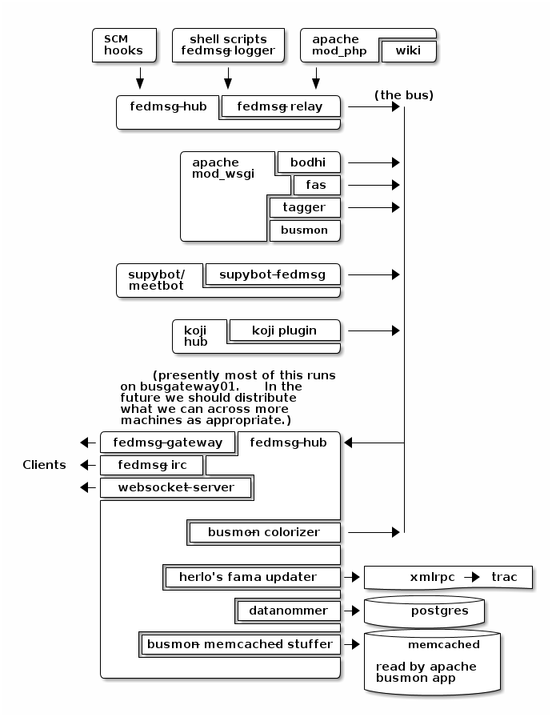

Bus Topology
============

This is an overview of the topology of the fedmsg bus as it is deployed in
Fedora Infrastructure.  This document along with the :doc:`status` will
evolve as we are able to integrate more services.

The section on the right labelled ``(the bus)`` is the NxM connection mesh
described in :doc:`overview`.
